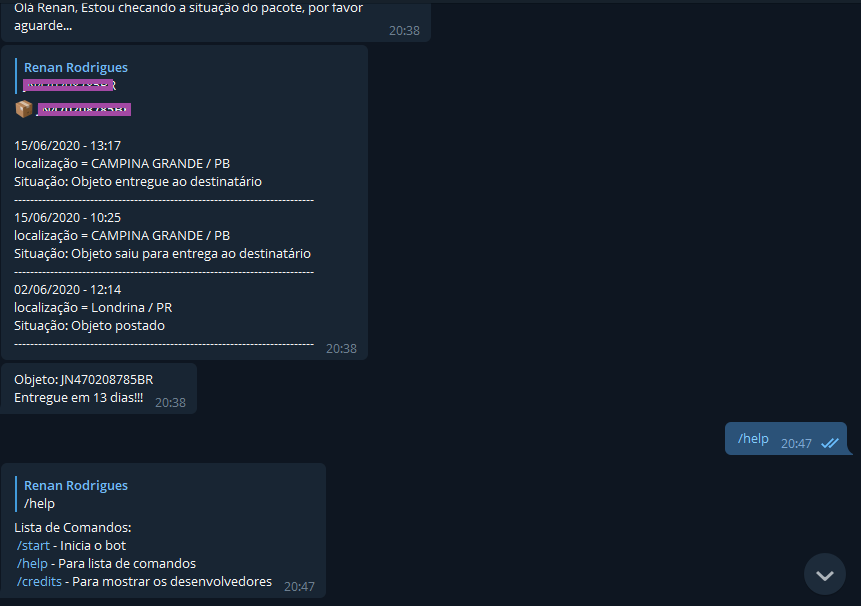
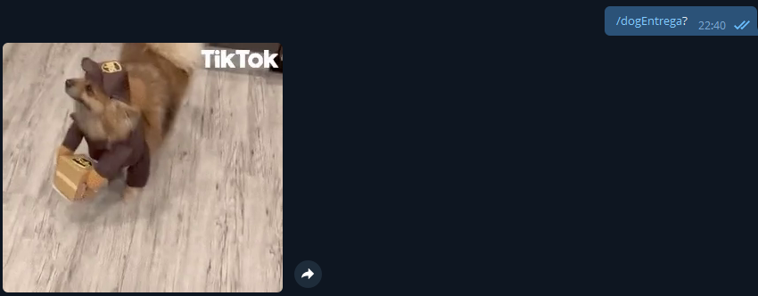

<h1 align ="left">
    
</h1>

## 🤖Sobre
O projeto **rastreioPy bot** é um bot que foi criado durante a cadeira de algoritmos com o intuito de colocarmos em prática o conhecimento aprendido em **python** durante o período.

O **bot** realiza através da plataforma do Telegram a consulta e o acompanhamento de pacotes dos correios. Sua localização, data e situação atual e seu histórico


<h1 align ="left">
    
</h1>


## 💻Tecnologias e Bibliotecas
O projeto foi desenvolvido utilizando as seguintes tecnologias

- Telegram
- pyrastreio
- telebot
<h1 align ="left">
    


## 📦Como baixar o Projeto e gerar o Token

```bash
# Clonar o repositório
$git clone https://github.com/rema

# Criar um token no BotFather (gerenciador do próprio telegram para criação de Bots)
-> dentro do BotFather no telegram: /start,/newbot,"nome do bot" para gerar o token
```

---
Desenvolvido por Renan Rey 🦞 e Wilton